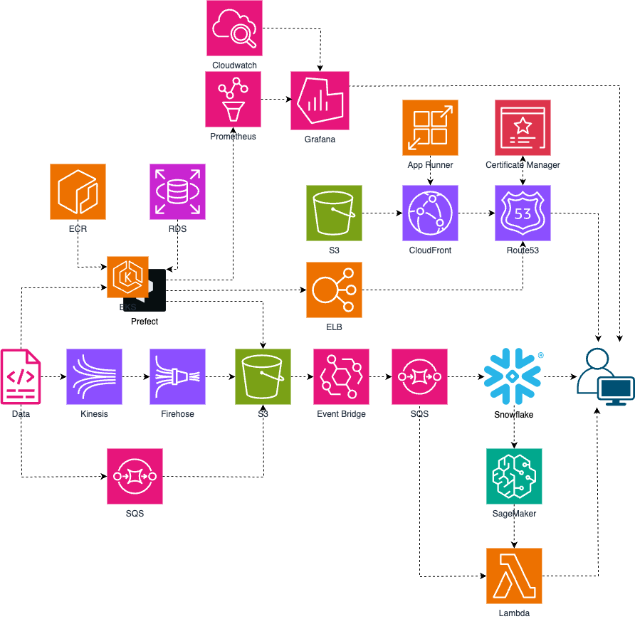

# Amazon Ads Innovation Challenge 2025

## System Overview

### Service Overview

PulsyAI revolutionizes the Amazon advertising landscape with a groundbreaking AI Assistant that transforms how sellers approach their marketing strategies. By replacing traditional complex dashboards and analytics tools with intuitive conversational AI, PulsyAI democratizes access to enterprise-level advertising intelligence for sellers of all sizes.

This cutting-edge AI Assistant leverages advanced machine learning algorithms and vast advertising datasets to deliver personalized, actionable insights through simple natural language conversations. Sellers can now unlock sophisticated advertising strategies, optimize campaign performance, and make data-driven decisions in real-time - all through an intelligent conversation that feels as natural as talking to an expert consultant.

PulsyAI represents a paradigm shift from reactive data analysis to proactive strategic guidance, empowering Amazon sellers to compete at the highest level with AI-powered precision and efficiency.

### Key Features

**🧠 Intelligent Conversational Interface**
- Natural language processing that understands complex advertising queries and business contexts
- Multi-modal input support including document analysis for comprehensive strategy development

**🎯 Proactive Intelligence Engine**
- AI-generated strategic recommendations tailored to individual seller profiles and market conditions
- Predictive insights that anticipate market trends and optimization opportunities

**🔗 Seamless Ecosystem Integration**
- Zero-friction Amazon account connectivity with real-time data synchronization
- Unified data intelligence platform eliminating the need for multiple tools and dashboards

**🛡️ Enterprise-Grade Security & Personalization**
- Personalized AI learning that adapts to individual seller behavior patterns for tailored recommendations
- Secure data handling ensuring complete privacy and compliance

**🚀 Future-Ready Innovation Pipeline**
- Advanced collaboration tools for team-based strategy development
- Comprehensive reporting automation with AI-generated insights
- Scalable architecture supporting enterprise-level operations and custom integrations

### AI/ML Architecture Diagram

[Snowflake architecture diagram including Cortex configuration will be placed here]

### Data Sources and Integration

*This section highlights key data sources utilized by PulsyAI. Beyond these primary sources, the system collects and leverages numerous additional data streams to provide comprehensive advertising intelligence and strategic insights.*

#### 1. Amazon Data
  
- **Transaction Data**
  - Amazon Marketing Stream
  - Amazon Ads Report
  - Amazon Marketing Cloud
  - Seller Partner Report

- **Master Data**
  - **Amazon Ads API**
    - Sponsored Products
    - Sponsored Brands
    - Sponsored Display
    - Amazon DSP
  - **Seller Partner Listings**

- **Recommendation Data**
  - **Sponsored Products** - Budget, Bid recommendations
  - **Sponsored Display** - Product Targeting, Audiences
  - **Amazon DSP** - Overapping audiences, Persona builder
  - Partner Opportunities, etc...

#### 2. Social Networking Service Data
- **TikTok**: Social commerce insights, trend analysis, and influencer marketing performance metrics
- **Google**: Search trends, competitive intelligence, and cross-platform advertising performance data
- **Meta**: Social media engagement analytics, audience insights, and multi-platform advertising attribution

#### 3. Market Data
- External market intelligence including competitive pricing, industry benchmarks, seasonal trends, and consumer behavior analytics

#### 4. Third Party Data
- Supplementary data sources encompassing customer demographics, purchase intent signals, market research insights, and industry-specific performance indicators

### System Infrastructure Architecture

The architecture diagram illustrates how PulsyAI processes real-time advertising intelligence through a sophisticated data flow pipeline designed for AI-powered conversational experiences.

#### System Data Flow & Processing Patterns

**1. Multi-Source Data Ingestion Flow**
User queries and external data streams enter the system through multiple entry points, triggering a cascade of real-time processing events. Raw advertising data from Amazon APIs, social media platforms, and market intelligence sources flow simultaneously into the ingestion layer, where event-driven microservices orchestrate the data transformation pipeline.

**2. Real-Time Stream Processing Architecture**
The system employs a distributed event streaming pattern where data flows through multiple processing stages:
- Initial data validation and enrichment occur at the edge
- Stream processing engines perform real-time aggregations and feature extraction
- Event-driven triggers initiate ML model inference based on data patterns
- Processed insights are immediately available for AI reasoning and response generation

**3. AI-Driven Request Processing Flow**
When users interact with the conversational AI:
- Natural language queries are processed through semantic understanding layers
- Context-aware retrieval systems fetch relevant advertising data using vector similarity
- Multi-step AI reasoning chains combine retrieved data with business logic
- Response generation occurs through iterative refinement with real-time data validation

**4. Hybrid Cloud-Edge Computing Pattern**
The architecture implements a hybrid processing model:
- Edge computing handles immediate response requirements (< 200ms)
- Cloud processing manages complex analytics and model training
- Intelligent caching layers optimize for frequently accessed patterns
- Load balancing distributes compute across geographic regions

#### Architectural Design Principles

**Event-Driven Microservices Pattern**
Loose coupling between services enables independent scaling and deployment. Each microservice publishes events that trigger downstream processing, creating a resilient system that can handle component failures gracefully.

**Data-Centric Architecture**
All system components are designed around data flow optimization. Data moves through the system with minimal transformation overhead, ensuring real-time responsiveness for AI-powered insights.

**Adaptive Scaling Strategy**
The system automatically adjusts resources based on:
- Query complexity and processing requirements
- Real-time data volume fluctuations
- AI model inference demands
- User interaction patterns

**Security-by-Design Approach**
Multi-layered security is embedded throughout the data flow:
- End-to-end encryption across all data transmission paths
- Zero-trust network architecture with service-to-service authentication
- Data lineage tracking for compliance and audit requirements

This architecture enables PulsyAI to deliver enterprise-grade AI insights with sub-second response times while maintaining security, scalability, and cost efficiency.

---

## Technical Stack

### Core Technology Decisions & Rationale

#### Frontend Framework Selection
**Next.js 14 with App Router** 
- React Server Components enable optimal SEO and initial load performance critical for conversational AI interfaces
- Streaming UI components for progressive AI response rendering, optimized for conversational experiences

#### AI/ML Processing Engine
**LangChain + LangGraph Integration**
- Industry-leading framework for production-grade conversational AI with stateful memory management
- Custom LangGraph workflows for multi-step advertising analysis, integrated prompt versioning system

**Snowflake Cortex AI**
- Only solution providing in-warehouse vector operations at scale with built-in LLM capabilities
- Real-time semantic search across 50M+ advertising records with sub-200ms response times

#### Backend Architecture Philosophy
**FastAPI + Python Async**
- Highest performance Python web framework with automatic OpenAPI generation for rapid development
- Async/await patterns throughout, Pydantic models for data validation, automatic rate limiting

#### Data Infrastructure Strategy
**Snowflake as Single Source of Truth**
- Unified data warehouse with native AI capabilities eliminates complex ETL between systems
- Zero-copy data sharing, automated data governance, real-time stream ingestion

**Amazon RDS (PostgreSQL) for Transactional Data**
- ACID compliance essential for user sessions and billing, better consistency than NoSQL for financial data
- Read replicas for analytics, connection pooling, automated backup with point-in-time recovery

#### Real-time Processing Architecture
**Amazon Kinesis Data Streams**
- Only AWS service supporting ordered processing of millions of advertising events per second
- Custom partitioning by advertiser ID, 24-hour retention for replay capabilities

**Prefect for Workflow Orchestration**
- Modern Python-native workflow engine with superior debugging and monitoring vs. traditional tools
- Dynamic task generation based on data volumes, automatic retry with exponential backoff

#### Security & Authentication Architecture
**Auth0 Enterprise**
- Enterprise-grade identity management with MFA and SSO required for advertising data compliance
- Custom claims for Amazon Seller permissions, automated user provisioning via SCIM

#### Development & Operations Strategy
**AWS App Runner + Container Strategy**
- Serverless containers with automatic scaling eliminate infrastructure management overhead
- Blue-green deployments, automatic HTTPS, integrated with ECR for CI/CD

**Hybrid Monitoring Approach**
- CloudWatch: Native AWS integration with zero configuration
- Prometheus + Grafana: Custom business metrics and advanced visualization capabilities
- CloudWatch for infrastructure, Prometheus for application-specific AI performance metrics
